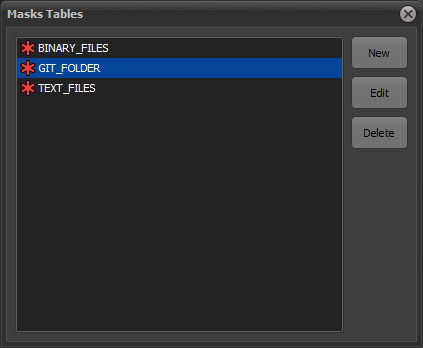
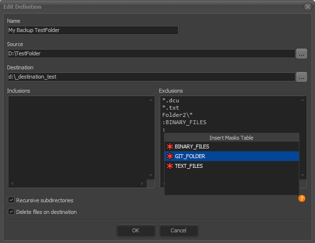

# Updater
Delphi App to synchronize folder contents

> The app is under development right now.

## Description

This application allows you to keep files synchronized by creating a list of repositories and allowing options like masks inclusions and exclusions.

The synchronization method is based on files write date/time property, so the application can quickly check if a file is updated.

There is a masks tables area, where you can insert several lists of masks, avoiding repeating group of masks in your repositories. In inclusions and exclusions masks, you can specify a literal mask, or specify a masks table, by prefixing table name with `:`.

## Dependency

This application depends on my component DzDirSeek, available here on GitHub: https://github.com/digao-dalpiaz/DzDirSeek

## To Do

- ~~ToolBar hidden when process running may look strange.~~
- ~~Splitter locked when process running because CheckListBox disabled.~~
- ~~Implement Masks Tables.~~
- ~~Help info in inclusions/exclusions memo.~~
- ~~Allow comments in inclusions/exclusions masks.~~
- ~~Change app theme.~~
- Deleted files are internally getting size but never used.
- Show total size on files report (New/Modified and Deleted).
