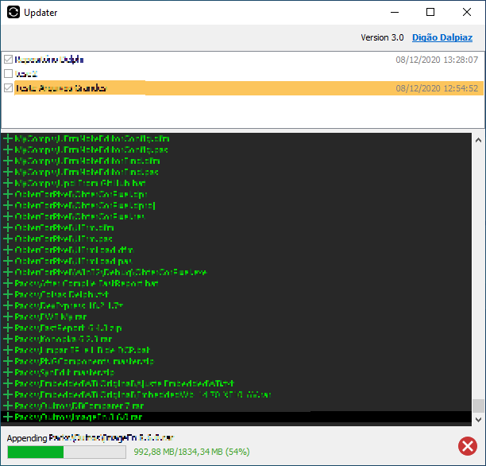

# Updater
Delphi App to synchronize folder contents

## Description

This application allows you to keep files synchronized by creating a list of repositories and allowing options like masks inclusions and exclusions.

The app is under development right now.

## To Do

- ToolBar hidden when process running may be strange?
- Splitter locked when process running because CheckListBox disabled.
- Deleted files are internally getting size but never used.
- Implement Masks Tables.
- Help info in inclusions/exclusions memo.
- Allow comments in inclusions/exclusions masks.
