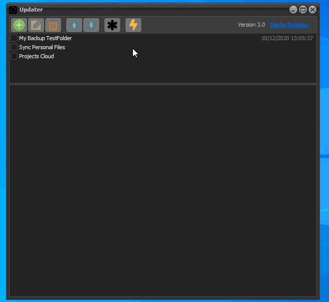

# Updater
Delphi App to synchronize folder contents

## Description

This application allows you to keep files synchronized by creating a list of repositories and allowing options like masks inclusions and exclusions.

The app is under development right now.

## Dependency

This application depends on my component DzDirSeek, available here on GitHub: https://github.com/digao-dalpiaz/DzDirSeek

## To Do

- ~~ToolBar hidden when process running may look strange.~~
- ~~Splitter locked when process running because CheckListBox disabled.~~
- Deleted files are internally getting size but never used.
- ~~Implement Masks Tables.~~
- Help info in inclusions/exclusions memo.
- ~~Allow comments in inclusions/exclusions masks.~~
- Show total size on files report (New/Modified and Deleted).
- ~~Change app theme.~~
